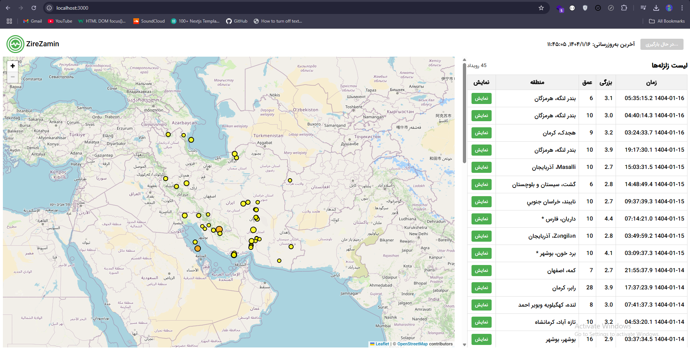
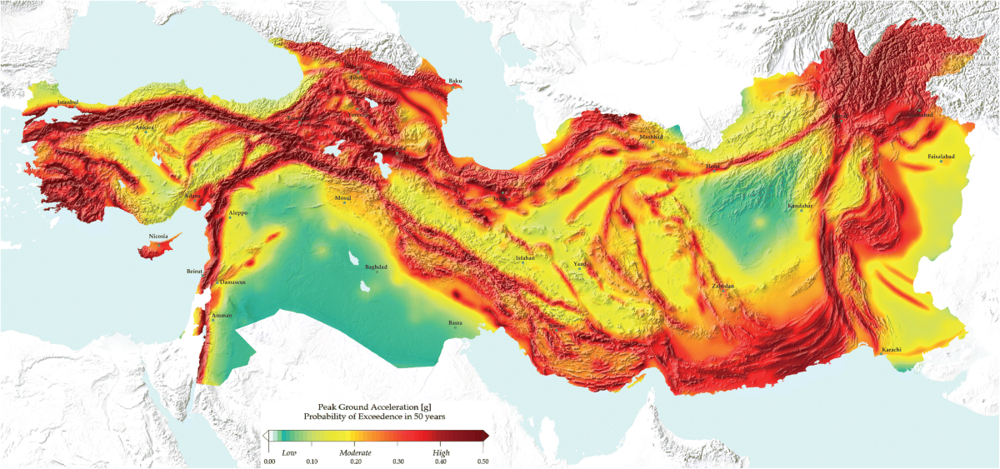

# ZireZamin - Iranian Seismological Monitoring 


## Overview
ZireZamin is an interactive web application designed to visualize and monitor earthquake data across Iran and surrounding regions. The dashboard provides a real-time map interface combined with a detailed data table, allowing users to track seismic activities efficiently.




## Features
- **Interactive Map**: Visualizes earthquake locations with color-coded markers based on magnitude
- **Detailed Data Table**: Displays comprehensive information about each seismic event
- **Point Selection**: Ability to focus on specific earthquakes by selecting them from the table
- **Color Coding**: Intuitive color system indicating earthquake severity:
  - Yellow: < 4 magnitude
  - Orange: 4-5.9 magnitude
  - Red: 6-6.9 magnitude
  - Purple: 7-7.9 magnitude
  - Brown: ≥ 8 magnitude

## Technology Stack

### Frontend
- **React**: ^18.0.0
- **React DOM**: ^18.0.0
- **React Scripts**: 5.0.1

### Mapping
- **Leaflet**: ^1.9.4
- **React-Leaflet**: ^4.2.1

### Data Fetching
- **Axios**: ^1.6.2
- **Node-Fetch**: ^2.6.1

## Architecture
The application follows a client-server architecture:
1. Backend API serves earthquake data via a REST endpoint (`https://zirzamin-api.mohammadhasanii.ir`)
2. React frontend fetches and displays the data visually

## Components

### MapController
Handles map state management including:
- Center point adjustments
- Zoom level control
- Smooth transitions between points

### Main Application
The core `App` component integrates:
- Data fetching and state management
- Map visualization with TileLayer from OpenStreetMap
- CircleMarker components for earthquake locations
- Data table with filtering and selection capabilities

## Data Visualization
- **Marker Size**: Proportional to earthquake magnitude
- **Marker Color**: Based on severity classification
- **Popup Information**: Includes DateTime, Magnitude, Depth, and Location

## User Interface
- **Layout**: Split-view design with map (66%) and data table (33%)
- **Direction**: RTL support for Persian text in the data table and popups
- **Responsive Design**: Adaptable to different screen sizes

## Functionality
1. **Data Loading**: Automatically fetches earthquake data on component mount
2. **Data Filtering**: Removes invalid coordinate entries
3. **Map Navigation**: Allows flying to specific earthquake locations
4. **Point Selection**: Highlights selected earthquakes in both map and table
5. **Popup Display**: Shows detailed information for each earthquake point

## Map Configuration
- **Boundaries**: Limited to specific geographic coordinates covering Iran and surrounding regions
- **Zoom Limits**: Min zoom: 5, Max zoom: 8
- **Bounds Viscosity**: Set to 1.0 for strict boundary enforcement

## Future Enhancements
- Time-based filtering
- Magnitude filtering
- Heatmap visualization option
- Historical data comparison
- Export functionality

## Installation and Setup
1. Clone the repository
2. Install dependencies:
   ```bash
   npm install
   ```
3. Ensure backend API is running at `https://zirzamin-api.mohammadhasanii.ir/`
4. Start the development server:
   ```bash
   npm start
   ```

## API Integration
The application expects the backend to provide earthquake data in the following format:
```json
[
  {
    "dateTime": "string",
    "magnitude": "number",
    "depth": "number",
    "location": "string",
    "latitude": "number",
    "longitude": "number"
  }
]
```

## Performance Considerations
- Reference-based marker management for efficient rendering
- Data validation to prevent rendering errors
- Optimized event handlers for smooth user experience

---

*ZireZamin - Monitoring What's Beneath Us*